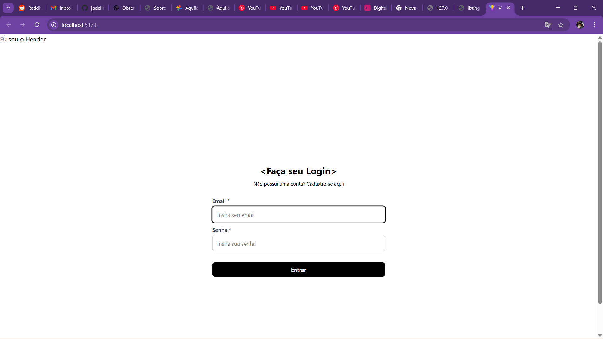

# Red Bull Project

Aplicação web full-stack com React + Vite no frontend e Express.js no backend.

## 🚀 Tecnologias

### Frontend
- React 
- Vite
- TailwindCSS
- Axios

### Backend
- Node.js
- Express.js
- MySQL2
- Prisma ORM
- CORS

## 📁 Estrutura do Projeto

```
redbull/
├── front/          # Frontend React
├── back/           # Backend Express
└── README.md
```

## ⚡ Instalação e Execução

### 🐳 Com Docker (Recomendado)

**Pré-requisitos:**
- Docker Desktop instalado
- Docker Compose

**Passos para executar:**

1. **Limpar cache e containers antigos:**
```bash
cd redbull
docker-compose down
docker system prune -f
```

2. **Deletar package-lock.json desatualizado:**
```bash
del front\package-lock.json
```

3. **Executar todos os serviços:**
```bash
docker-compose up --build
```

**Comandos úteis:**
```bash
# Executar em background
docker-compose up -d --build

# Parar os serviços
docker-compose down

# Ver logs
docker-compose logs

# Reconstruir apenas um serviço
docker-compose build --no-cache frontend
```

**Solução de problemas:**
- Se houver erro `crypto.hash is not a function`, delete o `package-lock.json` e rebuild
- Se o JSON Server não encontrar o arquivo, verifique se `src/server/db.json` existe
- Para limpar completamente: `docker system prune -a`

### 💻 Instalação Local

**Pré-requisitos:**
- Node.js (versão 18+)
- MySQL

**Backend:**
```bash
cd redbull/back
npm install
npm start
```

**Frontend:**
```bash
cd redbull/front
npm install
npm run dev
```

**JSON Server (desenvolvimento):**
```bash
cd redbull/front
npm run server
```

## 🌐 URLs

**Após executar com Docker:**
- Frontend: http://localhost:5173
- Backend: http://localhost:3000
- JSON Server: http://localhost:3001
- API Produtos: http://localhost:3001/products

**Status dos serviços:**
- ✅ Backend: "Servidor iniciado em http://localhost:3000"
- ✅ JSON Server: "JSON Server started on PORT :3001"
- ✅ Frontend: Deve iniciar sem erros crypto.hash

## 📱 Funcionalidades - Passo a Passo

### 1. Tela Inicial / Login
**Descrição:** Página de autenticação do usuário

**Funcionalidades:**
- Formulário de login com validação
- Campos: Email e Senha
- Validação em tempo real
- Link para cadastro
- Design responsivo

**Como usar:**
1. Acesse http://localhost:5173
2. Preencha o email (formato válido obrigatório)
3. Digite a senha (mínimo 6 caracteres)
4. Clique em "Entrar"
5. Para cadastro, clique no link "aqui"



---

### 2. Sistema de Produtos (JSON Server)
**Descrição:** Catálogo de produtos Red Bull disponível via API

**Produtos disponíveis:**
- **Bebidas Energéticas:**
  - Red Bull Energy Drink 250ml - R$ 8,99
  - Red Bull Sugarfree 250ml - R$ 9,49
  - Red Bull Tropical Edition 250ml - R$ 10,50

- **Merchandising:**
  - Boné Red Bull Racing - R$ 149,90
  - Camiseta Red Bull Racing - R$ 199,90

- **Colecionáveis:**
  - Miniatura Carro Red Bull RB19 - R$ 349,90

**Como acessar:**
1. Inicie o JSON Server: `npm run server`
2. Acesse: http://localhost:3001/products
3. Visualize todos os produtos em formato JSON


---

### 3. Layout Responsivo
**Descrição:** Interface adaptável para diferentes dispositivos

**Características:**
- Header com navegação
- Footer com informações da equipe
- Design mobile-first
- Cores e tipografia Red Bull

**Breakpoints:**
- Mobile: < 640px
- Tablet: 640px - 1024px
- Desktop: > 1024px


---

### 4. Componentes Reutilizáveis
**Descrição:** Sistema de componentes modulares

**Componentes disponíveis:**
- **InputField:** Campo de entrada com validação
- **SubmitButton:** Botão de envio estilizado
- **Header:** Cabeçalho da aplicação
- **Footer:** Rodapé com informações
- **SiteLayout:** Layout base das páginas

**Vantagens:**
- Código reutilizável
- Manutenção facilitada
- Consistência visual
- Performance otimizada


---

### 5. Validação de Formulários
**Descrição:** Sistema robusto de validação usando React Hook Form

**Validações implementadas:**
- **Email:**
  - Campo obrigatório
  - Formato de email válido
  - Mensagem de erro personalizada

- **Senha:**
  - Campo obrigatório
  - Mínimo 6 caracteres
  - Feedback visual em tempo real

**Estados do formulário:**
- Validação em tempo real
- Mensagens de erro específicas
- Prevenção de envio com dados inválidos


---

### 6. API Backend (Express)
**Descrição:** Servidor Express.js para gerenciamento de dados

**Endpoints disponíveis:**
- `GET /` - Status do servidor
- Preparado para integração com MySQL
- Middleware CORS configurado
- Suporte a variáveis de ambiente

**Como testar:**
1. Inicie o backend: `npm start`
2. Acesse: http://localhost:3000
3. Visualize: "🚀 Servidor Express rodando!"


---

## 🐛 Problemas Conhecidos e Soluções

### Frontend não inicia (crypto.hash error)
**Causa:** Incompatibilidade entre Vite 7+ e Node.js
**Solução:**
```bash
del front\package-lock.json
docker-compose build --no-cache frontend
```

### JSON Server não encontra db.json
**Causa:** Caminho incorreto no container
**Solução:** Arquivo deve estar em `src/server/db.json`

### Containers não param corretamente
**Solução:**
```bash
docker-compose down
docker system prune -f
```

## 🔧 Próximas Implementações

- [ ] Página de cadastro de usuários
- [ ] Dashboard de produtos
- [ ] Carrinho de compras
- [ ] Sistema de pagamento
- [ ] Área administrativa
- [ ] Integração com banco MySQL
- [ ] Autenticação JWT
- [ ] Upload de imagens

## 👥 Equipe

Projeto desenvolvido pela Equipe Red Bull
